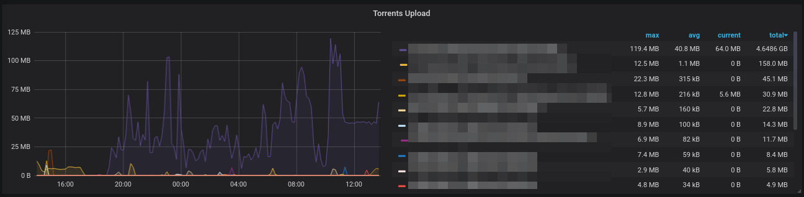
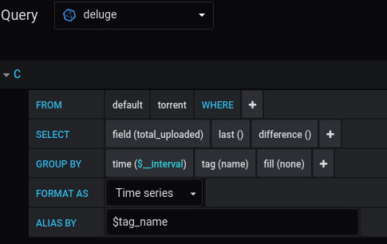

# deluge-influx
A simple python script to fetch metadeta from Deluge Web API and log it into an InfluxDB database.

You need to run this periodically using something like Cron.

# Usage
- Create a `deluge` database in your InfluxDB Server.
- Replace placeholders in script with ip and web password.
- Run
```
pip install -r requirements.txt
python deluge-influx.py
```

# Grafana
## Upload rate over time by torrent


